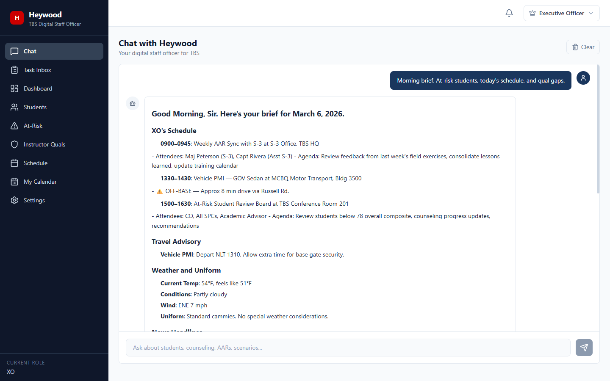
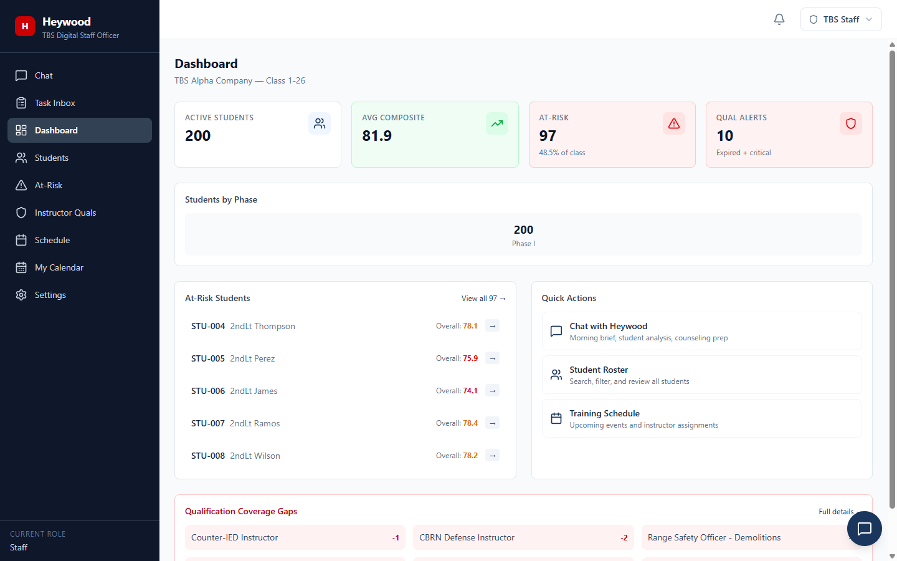
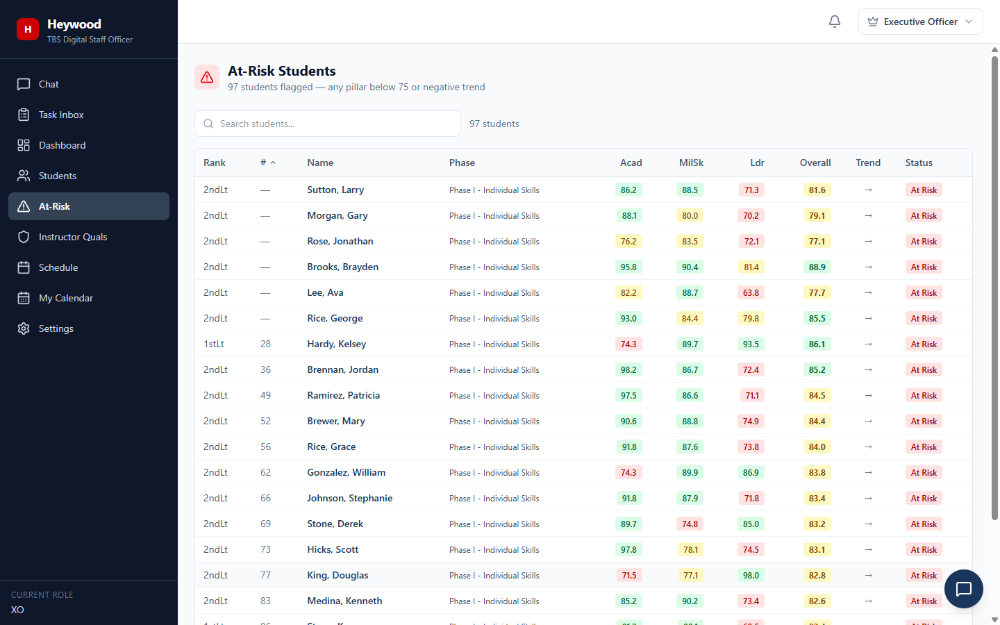
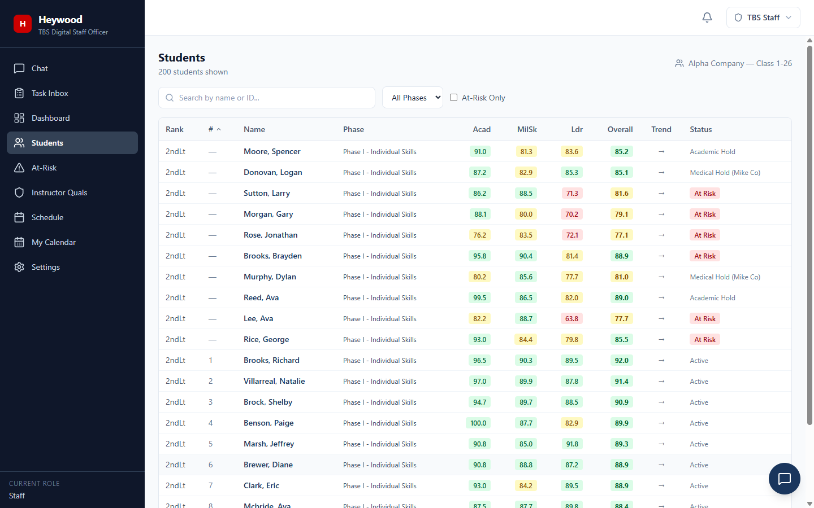
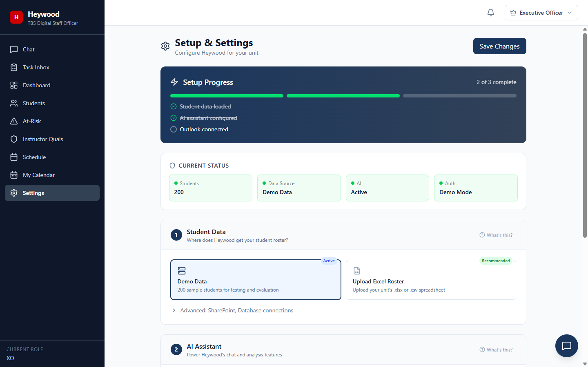

# Heywood — Digital Staff Officer for The Basic School

> *"Good Morning, Sir. Here's your brief for March 6, 2026."*

Every morning at TBS, staff officers spend 30-60 minutes piecing together the day — pulling student data from spreadsheets, checking the training schedule, reviewing at-risk lists, scanning email for updates. Heywood does it in 3 seconds.

Heywood is an AI-powered Digital Staff Officer that gives every Marine at The Basic School — from the XO to individual students — instant, role-appropriate access to the data they need. No spreadsheet hunting. No email chains. Just ask.

**[Live Demo](https://heywood-tbs.nicefield-9a8db973.eastus.azurecontainerapps.io/)** — try it now, no login required

---

## One Question, Full Situational Awareness

Ask Heywood for a morning brief and it pulls from every data source simultaneously — student performance, today's schedule, qualification gaps, weather, news, and your calendar — then delivers it in seconds, tailored to your role.



*The XO gets the full picture: schedule with travel advisories, weather and uniform call, at-risk students ranked by severity, qualification gaps by type, and proactive recommendations — all from a single question.*

---

## Role-Adaptive Views

Same app, different experience. Heywood automatically adjusts what you see based on who you are. A single deployment serves every role — the backend filters data per-request based on the authenticated identity, so there's no duplication, no separate apps, and no way for a student to see another company's data.

| Role | What They See |
|------|--------------|
| **Executive Officer** | Battalion-wide analytics, all companies, master calendar, full at-risk visibility |
| **Staff Officer** | TBS-wide data access, training schedule, instructor qualifications |
| **SPC (Company)** | Company-scoped student roster, company training events |
| **Student** | Personal record only — grades, schedule, upcoming quals |

---

## How the AI Actually Works

Most "AI" tools paste your question into a chatbot and hope for the best. Heywood is different — it **queries real data through tool use**, a pattern where the AI can call functions in your application to get facts instead of guessing.

Here's what happens when you ask *"How is 2ndLt Perez doing?"*:

1. Your question goes to the Go backend's `/api/v1/chat` endpoint
2. The backend sends it to GPT-4o along with a **system prompt** tuned to TBS (grading weights, pillar thresholds, military tone) and a **list of 12 tools** the AI is allowed to call
3. GPT-4o decides it needs student data and calls the `lookup_student` tool with `{"name": "Perez"}`
4. The Go backend executes that function against the DataStore — the same interface that serves the dashboard
5. Real student data (scores, trends, phase, status) returns to GPT-4o as structured JSON
6. GPT-4o composes a response using **actual data**, not hallucinated numbers
7. The response streams back to the React frontend with markdown rendering

The AI never sees the full database. It only sees what its tool calls return. It can't invent students, fabricate scores, or access data outside its defined tools. Every response includes a reminder that AI output requires human review.

### Available Tools

| Tool | What It Does |
|------|-------------|
| `lookup_student` | Find a student by name or ID, return full record |
| `search_students` | Filter students by company, phase, status, or score range |
| `get_at_risk` | List students flagged as at-risk with severity ranking |
| `get_student_stats` | Aggregate statistics — averages, distributions, trends |
| `get_schedule` | Training schedule for today, this week, or a specific date |
| `lookup_calendar` | Personal + master calendar events from Outlook |
| `get_qual_records` | Instructor qualification status and expiration dates |
| `get_qual_stats` | Qualification coverage gaps and readiness percentages |
| `web_search` | Search for doctrine references, regulations, current info |
| `create_task` | Turn a conversation directive into a tracked task |
| `send_message` | Route an internal message to a role or person |
| `create_notification` | Generate a notification for a specific role |

The system prompt adapts per role. When the XO asks a question, Heywood responds as a subordinate staff officer providing a brief. When a student asks, it responds as an advisor explaining their own performance. Same AI, different persona, different data scope.

---

## What's Inside

### Student Performance Dashboard
200-student roster with composite scoring across Academics (32%), Military Skills (32%), and Leadership (36%). Class rank, phase tracking, trend indicators, and status flags (Active, At Risk, Academic Hold, Medical Hold). The dashboard computes aggregates client-side from API data — there's no separate analytics service.



### At-Risk Identification
Automatic flagging when any pillar drops below 75 or trends negative across consecutive assessments. 97 students flagged in the demo dataset — sortable, searchable, with direct drill-down to individual records. At-risk logic runs in the DataStore layer, so it works identically regardless of backend (JSON, SQLite, PostgreSQL).



### Student Roster
Full searchable, sortable, paginated roster. Filter by phase, at-risk status, or search by name/ID. Click any student for a detailed performance breakdown showing pillar scores, exam history, and trend lines.



### Admin Settings
Web-based configuration — no CLI, no config files, no SSH. Data source selection, AI provider status, Outlook integration toggle, database connections. A guided setup wizard tracks configuration progress and validates each connection before saving. Only visible to XO and Staff roles.



### Additional Pages
- **Instructor Quals** — 12 TBS-specific qualifications tracked per instructor. Expiration monitoring, coverage gap analysis, readiness percentages by qualification type.
- **Training Schedule** — Full TBS schedule with event types, locations, lead instructors, graded/ungraded status. Filterable by phase and date range.
- **My Calendar** — Personal Outlook calendar merged with the master TBS training schedule. Color-coded by source. In demo mode, generates realistic mock events.
- **Task Inbox** — AI-generated tasks from conversation. When the XO tells Heywood *"have SSgt Diaz schedule remedial land nav for Perez,"* it creates a tracked task with priority, status, due date, and assignment.

---

## Architecture

```
┌─────────────────────────────────────────────────────┐
│                    React SPA (Vite)                   │
│   11 Pages · 30 Components · Tailwind CSS · Router   │
├─────────────────────────────────────────────────────┤
│               Go HTTP Server (net/http)               │
│   35+ REST Endpoints · Middleware Chain · Streaming   │
├───────────┬───────────┬────────────┬────────────────┤
│ DataStore │  AI Chat  │  MS Graph  │  Auth Provider  │
│ Interface │  Service  │  Client    │  Interface      │
├───────────┼───────────┼────────────┼────────────────┤
│ JSON      │ OpenAI    │ Calendar   │ Demo (cookie)   │
│ SQLite    │ Azure     │ Mail       │ CAC/PKI (x509)  │
│ PostgreSQL│ OpenAI    │ SharePoint │                  │
│ Excel     │           │ Teams      │                  │
└───────────┴───────────┴────────────┴────────────────┘
```

### Why This Architecture

**No frameworks.** The Go backend uses only the standard library's `net/http` — no Gin, no Echo, no Fiber. Go 1.22+ added method-based routing (`mux.HandleFunc("GET /api/v1/students", handler)`) which eliminated the only reason to use a framework. Fewer dependencies means fewer supply chain risks and simpler STIG compliance.

**No ORM.** Database queries are handwritten SQL in the store implementations. ORMs add complexity, hide performance problems, and make FIPS auditing harder. The DataStore interface provides the same abstraction an ORM would, but the implementation is visible and auditable.

**Interface-driven design.** The `DataStore` interface (46 lines, 27 methods) is the backbone of the application. Every handler, every AI tool, every API endpoint talks to this interface — never to a specific backend. Swapping from JSON files to PostgreSQL is a configuration change, not a code change.

**Single binary deployment.** `go build` produces one statically-linked binary. The React SPA is built at Docker image time and served by the Go server as embedded static files. No nginx, no reverse proxy, no runtime dependencies except the binary itself.

### Tech Stack

| Layer | Technology | Why |
|-------|-----------|-----|
| **Frontend** | React 18, TypeScript, Tailwind CSS, Vite | Type safety, utility-first CSS, fast builds |
| **Backend** | Go 1.24, stdlib `net/http` | Single binary, FIPS 140-3 native, zero CGO |
| **AI** | OpenAI GPT-4o / Azure OpenAI | Tool use support, best reasoning for data analysis |
| **Database** | JSON / SQLite / PostgreSQL | Start simple, scale when needed |
| **Microsoft 365** | Graph API (raw HTTP, no SDK) | Calendar, Mail, SharePoint, Teams |
| **Auth** | Cookie (demo) / X.509 cert (CAC) | Works in garrison and on MCEN |
| **Deployment** | Multi-stage Docker, Azure Container Apps | Same image for commercial + Azure Gov IL5 |

---

## The DataStore Interface

This is the core design pattern that makes Heywood adaptable. Instead of coupling the application to a specific database, every data operation goes through a Go interface:

```go
type DataStore interface {
    // 15 read operations
    ListStudents(company, phase, search string, atRiskOnly bool) []Student
    GetStudent(id string) (*Student, bool)
    StudentStats(company string) StudentStats
    AtRiskStudents(company string) []Student
    // ... instructor, schedule, qualification queries

    // 4 task operations (mutable)
    CreateTask(task Task) error
    ListTasks(assignedTo string) []Task
    // ... update, get

    // 4 message operations (mutable)
    // 4 notification operations (mutable)
}
```

Five backends implement this interface. The application code has zero knowledge of which one is active — it receives the interface at startup and calls methods on it.

| Backend | Best For | How It Works |
|---------|----------|-------------|
| **JSON** | Demo, development | Reads `data/*.json` files into memory at startup. All writes go to in-memory maps only — no disk persistence in demo mode. Ships with 200 synthetic students. |
| **SQLite** | Single-server production | Uses `modernc.org/sqlite` (pure Go, no CGO). Auto-creates tables on startup. Per-user data isolation via role-scoped queries. Recommended for most unit deployments. |
| **PostgreSQL** | Cloud production (MCEN) | Connection pooling via `pgx/v5`. Same auto-migration as SQLite. For multi-replica deployments on Azure Gov or cARMY. |
| **Excel (.xlsx)** | Transitioning units | Upload via admin page. Column auto-mapping with known aliases (e.g., "Last Name", "LAST NAME", "Surname" all map to `lastName`). Admin maps remaining columns manually. |
| **Hybrid** | Real-world units | Reference data (students, instructors, schedule) from Excel or SharePoint. Mutable data (tasks, messages, notifications) in SQLite. No database required for simple deployments. |

---

## Microsoft 365 Integration

One set of Graph API credentials unlocks four integrations. The client uses raw HTTP with OAuth2 client credentials flow — no Microsoft SDK, no heavy dependencies. Token caching with automatic refresh handles the OAuth lifecycle.

- **Outlook Calendar** — Personal calendar merged with a shared master training calendar. Events from both sources appear in a unified view, color-coded by origin.
- **Outlook Mail** — Unread count for the notification badge, recent message subjects and senders for the mail summary widget.
- **SharePoint** — Site discovery by URL, list browsing, document library navigation, file access. Used both for data import (SharePoint lists as a DataStore backend) and document browsing in the admin UI.
- **Teams** — Team listing, channel enumeration, shared file access per channel.

### National Cloud Support

Military networks use different Microsoft cloud endpoints than commercial Azure. Heywood supports all three:

| Cloud | Login Endpoint | Graph Endpoint | Use Case |
|-------|---------------|----------------|----------|
| **Commercial** | `login.microsoftonline.com` | `graph.microsoft.com` | Development, commercial Azure |
| **GCC High** | `login.microsoftonline.us` | `graph.microsoft.us` | MCEN, most DoD tenants |
| **DoD** | `login.microsoftonline.us` | `dod-graph.microsoft.us` | IL5+ environments |

Set `GRAPH_CLOUD=gcc-high` or `GRAPH_CLOUD=dod` and all Graph API calls route to the correct endpoints. The permission scope uses `Sites.Selected` (not `Sites.ReadWrite.All`) which passes MCEN security review.

---

## Authentication

Two modes, one interface. The `IdentityProvider` interface defines a single method — `Authenticate(r *http.Request) UserIdentity` — and each mode implements it differently:

| Mode | How It Works | Use Case |
|------|-------------|----------|
| **Demo** | Reads a `heywood-role` cookie set by the role picker dropdown in the UI. No credentials required. | Evaluation, training, demos |
| **CAC/PKI** | Parses the X.509 client certificate from the `X-ARR-ClientCert` header (forwarded by Azure App Service). Extracts the EDIPI from the cert's Common Name (`LAST.FIRST.MI.1234567890`). Looks up the EDIPI in `user-roster.json` to determine role, company, and display name. | Production on MCEN |

The middleware injects the authenticated identity into every request's context. Handlers call `middleware.GetRole(ctx)` to filter data — a student handler returns only that student's records, while the XO handler returns the full roster.

---

## Security

- **FIPS 140-3 compliance** — Go 1.24's native `GOFIPS140=latest` flag enables the FIPS-validated crypto module at compile time. No BoringCrypto, no CGO, no OpenSSL. The binary is statically linked and the crypto boundary is the Go runtime itself.
- **Zero CGO** — The entire application, including SQLite (via `modernc.org/sqlite`), compiles with `CGO_ENABLED=0`. This means no shared library dependencies, no glibc version issues, and a container image that runs on `alpine` without compatibility shims.
- **Non-root container** — The Docker image runs as UID 1000 (`heywood` user), per DISA STIG requirements for containerized applications.
- **Security headers** — Every response includes `X-Content-Type-Options`, `X-Frame-Options`, `Strict-Transport-Security`, and `Content-Security-Policy` via the SecurityHeaders middleware.
- **No secrets in the image** — API keys, Graph credentials, and database connection strings are injected via environment variables at runtime. The Docker image contains only the binary, static assets, and synthetic demo data.

---

## Project Structure

```
heywood-tbs/
├── app/
│   ├── cmd/server/main.go          # Entry point — wires everything together
│   ├── internal/
│   │   ├── ai/                     # AI chat service, system prompts, tool definitions
│   │   │   ├── chat.go             #   OpenAI/Azure OpenAI client with tool use loop
│   │   │   ├── prompts.go          #   Role-adaptive system prompts (XO, Staff, SPC, Student)
│   │   │   ├── tools.go            #   12 tool definitions in OpenAI function-calling format
│   │   │   └── weather.go, news.go #   Live data services (weather, news, traffic)
│   │   ├── api/                    # HTTP handlers — one file per domain
│   │   │   ├── router.go           #   35+ routes registered on stdlib ServeMux
│   │   │   ├── chat.go             #   POST /api/v1/chat — tool execution dispatcher
│   │   │   ├── students.go         #   Student CRUD + stats + at-risk
│   │   │   ├── calendar.go         #   Outlook calendar + mail endpoints
│   │   │   ├── graph.go            #   SharePoint + Teams endpoints
│   │   │   ├── settings.go         #   Admin config + upload + column mapping
│   │   │   └── auth.go             #   /auth/me, /auth/switch
│   │   ├── auth/                   # Authentication providers
│   │   │   ├── provider.go         #   IdentityProvider interface + UserIdentity struct
│   │   │   ├── demo.go             #   Cookie-based role picker
│   │   │   └── cac.go              #   X.509 → EDIPI → role lookup
│   │   ├── calendar/               # Calendar abstraction
│   │   │   ├── outlook.go          #   Real Outlook via Graph API
│   │   │   └── mock.go             #   Demo mode with generated events
│   │   ├── data/                   # DataStore implementations
│   │   │   ├── iface.go            #   27-method DataStore interface
│   │   │   ├── store.go            #   JSON file store (demo/dev)
│   │   │   ├── sql_store.go        #   SQLite + PostgreSQL
│   │   │   ├── excel_store.go      #   Excel .xlsx import
│   │   │   ├── hybrid_store.go     #   Reference from one source, mutable from another
│   │   │   ├── colmap.go           #   Column auto-mapping with military aliases
│   │   │   └── connector.go        #   Factory: reads settings.json, returns correct store
│   │   ├── middleware/             # HTTP middleware chain
│   │   │   └── auth.go             #   CORS, security headers, auth injection
│   │   ├── models/                 # Shared data types (Student, Task, CalendarEvent, etc.)
│   │   └── msgraph/                # Microsoft Graph API client
│   │       ├── client.go           #   OAuth2 token management, multi-cloud dispatch
│   │       ├── sharepoint.go       #   Sites, lists, drives, files
│   │       └── teams.go            #   Teams, channels, shared files
│   ├── web/                        # React SPA
│   │   └── src/
│   │       ├── pages/              #   11 page components
│   │       ├── components/         #   Reusable UI (sidebar, header, chat, roster)
│   │       ├── hooks/              #   useAuth, useChat, ChatContext
│   │       └── lib/                #   API client, types, utilities
│   ├── data/                       # Synthetic demo data (200 students, instructors, schedule)
│   └── Dockerfile                  # Multi-stage build (Node → Go → Alpine)
├── screenshots/                    # App screenshots for README
├── prompts/                        # AI prompt engineering playbook
└── docs/                           # Briefing materials, build plans
```

**41 Go source files** across 8 packages. **30 TypeScript/React files** across pages, components, hooks, and utilities.

---

## Quick Start

### Local Development

```bash
cd app
go mod download
cd web && npm ci && npm run build && cd ..
go build -o heywood ./cmd/server
OPENAI_API_KEY=sk-... ./heywood -dev -port 8080
```

Open `http://localhost:8080`. Pick a role. Ask for a morning brief.

The `-dev` flag enables CORS for the Vite dev server (port 5173) and sets Secure=false on cookies for HTTP. Without `-dev`, the Go server serves the built React SPA from `web/dist/` and handles SPA routing (all non-API routes serve `index.html`).

### Docker

```bash
cd app
docker build -t heywood-tbs .
docker run -p 8080:8080 -e OPENAI_API_KEY=sk-... heywood-tbs
```

The multi-stage Dockerfile:
1. **Stage 1** (`node:22-alpine`): Installs npm dependencies and builds the React SPA
2. **Stage 2** (`golang:1.24-alpine`): Downloads Go modules and compiles the server with `CGO_ENABLED=0 GOFIPS140=latest` for FIPS compliance
3. **Stage 3** (`alpine:3.21`): Copies the single binary, static assets, and demo data into a minimal image running as non-root

Final image is ~30MB. Contains zero development tools, zero package managers, zero shell utilities beyond what Alpine provides.

---

## Environment Variables

| Variable | Required | Description |
|----------|----------|-------------|
| `OPENAI_API_KEY` | One AI provider | OpenAI API key |
| `AZURE_OPENAI_ENDPOINT` | One AI provider | Azure OpenAI endpoint URL |
| `AZURE_OPENAI_KEY` | With Azure | Azure OpenAI API key |
| `AZURE_OPENAI_DEPLOYMENT` | With Azure | Model deployment name (e.g., `gpt-4o`) |
| `AUTH_MODE` | No | `cac` for CAC/PKI authentication, omit for demo mode |
| `GRAPH_TENANT_ID` | For M365 | Azure AD tenant ID for Microsoft Graph |
| `GRAPH_CLIENT_ID` | For M365 | App registration client ID |
| `GRAPH_CLIENT_SECRET` | For M365 | App registration client secret |
| `GRAPH_CLOUD` | No | `commercial` (default) / `gcc-high` / `dod` |
| `GRAPH_MASTER_CALENDAR_ID` | No | Shared calendar ID for TBS-wide events |
| `SEARXNG_URL` | No | SearXNG instance URL for web search tool |

The backend auto-detects which AI provider to use: if `AZURE_OPENAI_ENDPOINT` is set, it uses Azure OpenAI; if `OPENAI_API_KEY` is set, it uses OpenAI directly; if neither is set, Heywood falls back to mock responses so the rest of the application still works.

---

## By the Numbers

- **~8,800 lines Go** across 41 files in 8 packages
- **~4,400 lines TypeScript/React** across 30 files and 11 pages
- **35+ REST API endpoints** serving JSON
- **27-method DataStore interface** with 5 backend implementations
- **12 AI tools** for grounded, data-driven conversational access
- **4 Microsoft Graph integrations** (Calendar, Mail, SharePoint, Teams)
- **3 national cloud endpoints** (Commercial, GCC High, DoD)
- **2 auth modes** (Demo role picker + CAC/PKI via X.509)
- **FIPS 140-3** compliant cryptography, zero CGO dependencies
- **Single Docker image** (~30MB) for commercial + Azure Gov IL5

---

## Foundation

Built on [Expert-Driven Development (EDD)](https://github.com/jeranaias/expertdrivendevelopment) — a 6-course AI training curriculum with 51 prompt templates and governance SOP for responsible DoD AI adoption. EDD teaches non-technical personnel to build institutional tools using AI as the development accelerator. Heywood is the reference implementation — proof that the methodology works.

---

## License

This project is licensed under the [GNU Affero General Public License v3.0 (AGPL-3.0)](LICENSE).

You are free to use, modify, and deploy this software. If you run a modified version as a network service, you must release your source code under the same license. For commercial licensing inquiries, contact the author.

---

**Classification:** UNCLASSIFIED // Distribution Unlimited

Do not include classified, CUI, PII, or operationally sensitive information in this repository. All student data is synthetic.
